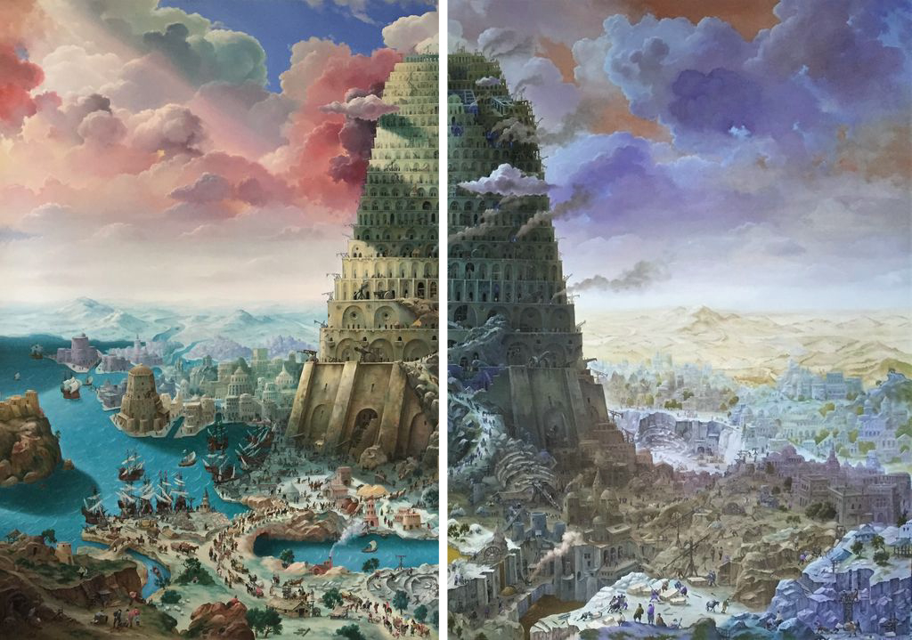

# PCV_TUGAS

Program ini dapat membaca dan menampilkan gambar yang sudah terfilter.\
Filter pada gambar adalah menukar nilai biru ke channel merah dan nilai merah ke channel biru.\
Berikut adalah perbandingan gambar sebelum dan sesudah difilter.

Selain menampilkan gambar, program juga dapat membaca webcam dan menampilkannya.\
Webcam yang dibaca difilter per 50 frame, mulai dari filter warna biru, hijau, merah, dan filter tukar data warna.

