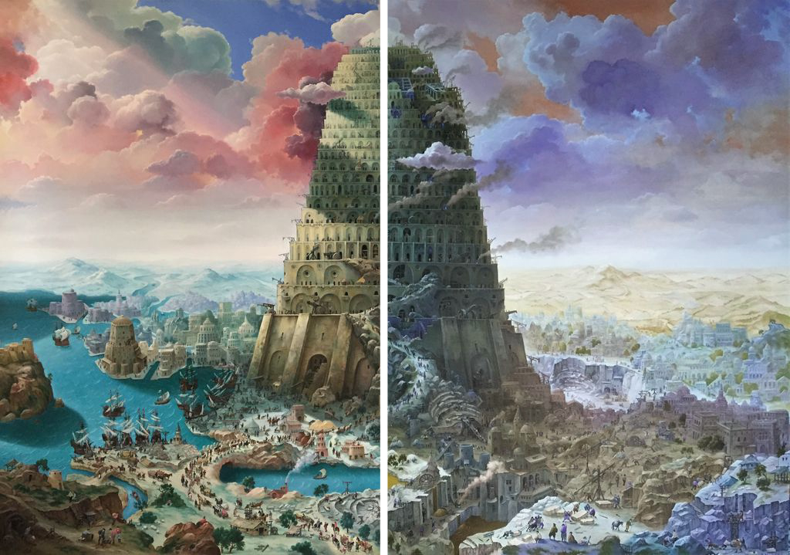

# Tugas Pengolahan Citra dan Video

Kumpulan program sederhana terkait pengolahan citra digital menggunakan Python dan beberapa library. Program disusun bertahap agar sesuai dengan materi mingguan.

## Urutan Program

1. [`intro.py`](#1-intropy) — membaca citra, memisahkan channel warna, serta menerapkan filter warna pada gambar dan video.
2. [`ti-eq.py`](#2-ti-eqpy) — menerapkan transformasi intensitas secara manual dan menyiapkan bagian untuk ekualisasi histogram.
3. [`filter-spasial.py`](#3-filter-spasialpy) — mempelajari konvolusi spasial secara eksplisit menggunakan kernel.

---

# 1. `intro.py`

Program pengenalan operasi dasar citra berwarna menggunakan BGR channel pada OpenCV.\
Program ini dapat membaca dan menampilkan gambar yang sudah terfilter.\
Filter pada gambar adalah menukar nilai biru ke channel merah dan nilai merah ke channel biru.\
Berikut adalah perbandingan gambar sebelum dan sesudah difilter.

Selain menampilkan gambar, program juga dapat membaca webcam dan menampilkannya.\
Webcam yang dibaca difilter per 50 frame, mulai dari filter warna biru, hijau, merah, dan filter tukar data warna.

---

# 2. `ti-eq.py`
Program ini berisi implementasi manual beberapa transformasi intensitas citra grayscale. Karena manual, jadi tidak menggunakan fungsi bawaan library.

### 2.1 Citra Negatif
Setiap nilai intensitas `r` dibalik terhadap rentang grayscale `0–255`.
Hasil gambar yang sudah dibalik:

### 2.2 Transformasi Log
Program menghitung transformasi menggunakan `math.log()` secara manual, kemudian membatasi hasil ke rentang `0–255` sebelum dikonversi kembali ke `uint8`.
Hasil gambar setelah transformasi:

### 2.3 Transformasi Gamma
Menggunakan nilai gamma di bawah `1` untuk membuat citra menjadi lebih terang.
Hasil gambar setelah transformasi:

### 2.4 Contrast Stretching
Program terlebih dahulu mencari nilai minimum dan maksimum intensitas secara manual, kemudian dengan rumus transformasi didapatkan gambar yang lebih contrast (melebar histogramnya-nilai terlalu tinggi/rendah semakin bergeser dan nilai tengah bergeser sedikit).
Hasil gambar setelah transformasi:

### 2.5 Piecewise Linear Transformation
Program membuat beberapa titik. Titik-titik ini menentukan agar nilai intensitas dibagi menjadi tiga daerah.
Masing-masing daerah mempunyai persamaan linear sendiri.
Hasil gambar setelah transformasi:

### 2.6 Thresholding
Program menggunakan nilai threshold yang ditentukan untuk diterapkan pada aturan threshold. Nilai threshold menentukan titik mana gambar menjadi sepenuhnya gelap/terang.
Hasil gambar setelah transformasi:

---

# 3. `filter-spasial.py`
Program ini memperkenalkan filter spasial melalui implementasi konvolusi yang ditulis secara eksplisit.
